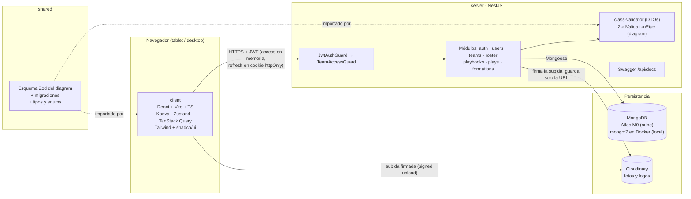
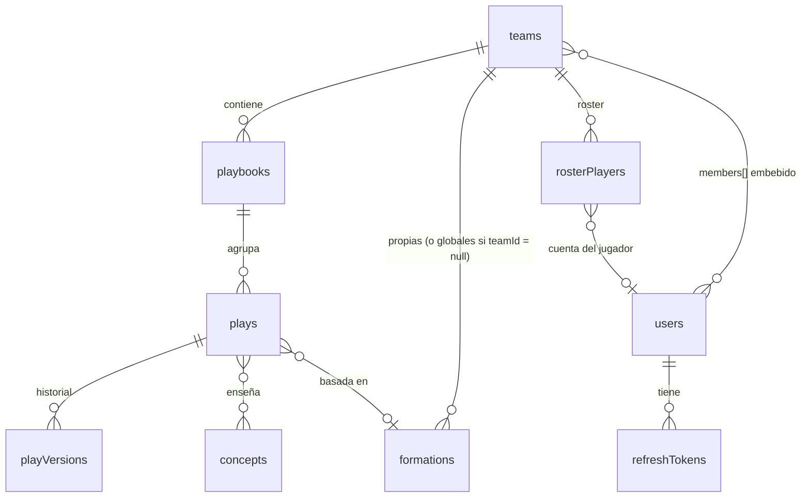

# PlayBook Pro · Plan de la Fase 1 (MVP con MongoDB)

> Estado: **plan aprobado por Proplayer (2026-10-06)**. No hay código escrito todavía. El siguiente paso es el bloque 0 (setup del monorepo), en cuanto haya un repositorio conectado.

> **Ajustes al montar el bloque 0 (2026-10-06):** NestJS 12 ya es ESM y su plantilla oficial usa **Vitest** y **oxlint**, así que los usamos en lugar de Jest y ESLint. La API de tests es casi idéntica a la de Jest y mongodb-memory-server funciona igual. TypeScript 6 (la versión 7 todavía no es compatible con todas las herramientas). El endpoint de salud es `/api/health`, porque todas las rutas cuelgan de `/api`.

Mini glosario de fútbol americano que uso en este documento:

| Término                     | Qué es                                                                                                              |
| --------------------------- | ------------------------------------------------------------------------------------------------------------------- |
| **LOS** (Line of Scrimmage) | La línea de golpeo: la línea imaginaria donde está el balón antes del snap. Todas las coordenadas parten de aquí.   |
| **Snap**                    | El momento en que el center pasa el balón al QB. Es el "tiempo 0" de cada jugada.                                   |
| **Hash marks**              | Las marcas interiores del campo donde se coloca el balón (izquierda, centro o derecha).                             |
| **Formation**               | Cómo se alinean los 11 jugadores antes del snap (Shotgun, I-Form, 4-3...).                                          |
| **Route tree**              | El "árbol" numerado de rutas de los receptores (0 a 9: flat, slant, comeback, curl, out, dig, corner, post, go...). |
| **Motion**                  | Un jugador ofensivo que se mueve antes del snap.                                                                    |
| **Blitz**                   | Un defensor (LB, CB o S) que ataca al QB en lugar de cubrir.                                                        |
| **Zone / Man**              | Cobertura por zona (defiendes un área) o al hombre (sigues a un jugador).                                           |

---

## 1. Diagrama de arquitectura



**Por qué así:**

- **El esquema Zod vive en `shared`** y lo importan los dos lados. El editor valida mientras el coach dibuja y la API vuelve a validar antes de guardar. Una sola fuente de verdad: si cambia la forma de una jugada, se cambia en un solo sitio.
- **Dos guards en cadena** en cada ruta de equipo: primero "¿estás logueado?" y luego "¿eres coach de este equipo?". Así el filtro por `teamId` no depende de que nadie se acuerde de ponerlo en cada consulta.
- **Las fotos van directo del navegador a Cloudinary** con una firma que genera la API. El archivo nunca pasa por nuestro servidor (más rápido y más barato) y en Mongo solo queda la URL.
- **Access token en memoria y refresh token en cookie `httpOnly`**. Si alguien inyecta JavaScript en la página, no puede robar el refresh token.

### Decisiones de diseño que te propongo (y en qué cambian tu pedido)

1. **Un solo rol por ahora: el coach, y un equipo puede tener varios** (por ejemplo, el coordinador ofensivo y el defensivo). Todos los coaches de un equipo tienen los mismos permisos sobre todo su playbook. No hay jugadores con cuenta ni otros roles. Aun así, el equipo guarda una lista `members` con un único rol `COACH`: cuando más adelante lleguen los jugadores (modo jugador, Fase 3), solo habrá que añadir un valor al enum, sin migrar datos.
2. **Rutas anidadas por equipo:** `/teams/:teamId/plays`, `/teams/:teamId/roster`... El `teamId` siempre viene en la URL, el `TeamMemberGuard` lo comprueba y los services lo reciben como parámetro obligatorio. Es la forma más difícil de olvidarse del aislamiento entre equipos.
3. **Colección extra `refreshTokens`.** Sin ella no se puede cerrar sesión de verdad ni detectar un refresh token robado. Guardamos el hash del token con fecha de expiración y Mongo borra los vencidos solo (índice TTL).
4. **`shareLinks` con `targetType` + `targetId`** en lugar de "`playId` o `playbookId`". Un campo opcional que a veces está y a veces no complica las consultas y los índices. Además guardamos el **hash** del token, no el token: si alguien lee la base de datos, no puede usar los links.
5. **El `diagram` se guarda en Mongoose como objeto libre y lo valida Zod**, en vez de repetir el esquema con decoradores `@Prop`. Si lo definiéramos dos veces (Zod y Mongoose), tarde o temprano se desincronizarían.
6. **Bloqueo optimista con `version`.** Si editas la misma jugada en la tablet y en el portátil, el segundo guardado recibe un error 409 ("alguien la cambió") en vez de pisar el trabajo del otro sin avisar.
7. **El contenedor local de Mongo corre como replica set de un nodo.** Guardar una jugada y su versión en el historial debe ser atómico (una transacción), y MongoDB solo permite transacciones en replica sets. Atlas ya lo es; el contenedor local hay que configurarlo así (te lo dejo hecho en el `docker-compose`).
8. **El dorsal no es único dentro del roster.** En college y high school dos jugadores pueden llevar el mismo número si no juegan en la misma unidad (uno en ofensiva y otro en defensiva). La UI avisa del duplicado, pero no lo bloquea.

---

## 2. Schemas de Mongoose e índices

Convenciones comunes a todos:

- `_id` y todas las referencias son **UUIDv7 como string** (ver 2.0).

- `timestamps: true` → `createdAt` y `updatedAt` automáticos.
- `deletedAt: Date | null` en `plays` y `playbooks` (borrado lógico). Un plugin de Mongoose añade `deletedAt: null` a todas las búsquedas para no repetirlo a mano.
- Cada schema exporta su tipo `XDocument = HydratedDocument<X>`.
- Nombres de colección explícitos (`collection: 'rosterPlayers'`) para que Mongoose no los pluralice a su manera.
- Enums importados de `@playbook/shared` para que front y back usen los mismos valores.

### 2.0 Identificadores: UUIDv7 en todas las colecciones

Todos los ids del sistema (el `_id` de cada documento, las referencias entre colecciones y los ids internos del diagram) son **UUIDv7** en lugar del ObjectId de Mongo.

Definición común → `server/src/database/uuid-id.ts`:

```ts
import { v7 as uuidv7 } from 'uuid';

// Se usa como @Prop(UUID_ID) _id!: string; en cada schema
export const UUID_ID = { type: String, default: () => uuidv7() } as const;
```

- **Se guardan como texto** (`"0199b4e2-7c1a-7d3e-9f42-3b8a1c5e6d70"`), no como binario. Ocupan 36 bytes en vez de 16, pero se leen tal cual en Atlas, viajan igual en JSON y Zod los valida sin conversiones. Con el volumen de este proyecto, la diferencia de tamaño no se nota.
- **Por qué UUIDv7 es buena elección:** los primeros caracteres son la fecha de creación, así que los ids nuevos se insertan "al final" del índice (igual que el ObjectId) y no lo fragmentan como haría un UUIDv4 aleatorio. Además, ordenar por `_id` equivale a ordenar por fecha de creación.
- **Se generan en la aplicación**, no en Mongo. El editor también puede crear el id de un jugador o una ruta sin preguntar al servidor, lo que facilita el autoguardado y el trabajo sin conexión más adelante.
- Los parámetros de URL (`:teamId`, `:playId`...) se validan con un `ParseUuidPipe` (Zod `z.uuid({ version: 'v7' })`) y devuelven 400 si no son UUIDv7.
- **Cuidado:** un UUIDv7 revela cuándo se creó el documento y es parcialmente predecible. **Nunca se usa como secreto.** Los tokens de `shareLinks` y de refresh son 32 bytes aleatorios (`crypto.randomBytes`), aparte del id.

### 2.1 `users` → `server/src/modules/users/schemas/user.schema.ts`

```ts
@Schema({ collection: 'users', timestamps: true })
export class User {
  @Prop(UUID_ID) // UUIDv7 en lugar de ObjectId (ver 2.0)
  _id!: string;

  @Prop({ required: true, lowercase: true, trim: true })
  email!: string;

  @Prop({ required: true, select: false }) // nunca sale en las consultas salvo que se pida
  passwordHash!: string;

  @Prop({ required: true, trim: true, maxlength: 80 })
  name!: string;

  @Prop()
  avatarUrl?: string;
}
export const UserSchema = SchemaFactory.createForClass(User);
UserSchema.index({ email: 1 }, { unique: true });
```

### 2.2 `refreshTokens` (nueva) → `server/src/modules/auth/schemas/refresh-token.schema.ts`

```ts
@Schema({ collection: 'refreshTokens', timestamps: true })
export class RefreshToken {
  @Prop(UUID_ID) // UUIDv7 en lugar de ObjectId (ver 2.0)
  _id!: string;

  @Prop({ type: String, ref: 'User', required: true })
  userId!: string;

  @Prop({ required: true })
  tokenHash!: string; // SHA-256 del token, nunca el token

  @Prop({ required: true })
  family!: string; // cadena de rotación: si se reutiliza uno viejo, se revoca toda la familia

  @Prop({ required: true })
  expiresAt!: Date;

  @Prop({ type: Date, default: null })
  revokedAt!: Date | null;
}
RefreshTokenSchema.index({ tokenHash: 1 }, { unique: true });
RefreshTokenSchema.index({ userId: 1, family: 1 });
RefreshTokenSchema.index({ expiresAt: 1 }, { expireAfterSeconds: 0 }); // TTL: Mongo los borra al vencer
```

### 2.3 `teams` → `server/src/modules/teams/schemas/team.schema.ts`

```ts
@Schema({ _id: false })
export class TeamMember {
  @Prop({ type: String, ref: 'User', required: true })
  userId!: string;

  @Prop({ type: String, enum: ['COACH'], default: 'COACH' }) // único rol en Fase 1; PLAYER llegará en Fase 3
  role!: TeamRole;

  @Prop({ default: () => new Date() })
  joinedAt!: Date;
}

@Schema({ collection: 'teams', timestamps: true })
export class Team {
  @Prop(UUID_ID) // UUIDv7 en lugar de ObjectId (ver 2.0)
  _id!: string;

  @Prop({ required: true, trim: true, maxlength: 80 })
  name!: string;

  @Prop()
  logoUrl?: string;

  // Reglamento: define la separación de los hash marks al dibujar la cancha
  @Prop({ type: String, enum: ['high_school', 'college', 'nfl'], default: 'college' })
  ruleset!: Ruleset;

  @Prop({ type: [SchemaFactory.createForClass(TeamMember)], default: [] })
  members!: TeamMember[];
}
TeamSchema.index({ 'members.userId': 1 }); // "¿de qué equipos soy coach?"
```

En la Fase 1, quien crea el equipo queda como su primer coach. Cualquier coach del equipo puede añadir a otro coach escribiendo el email de un usuario ya registrado, y también puede quitarlo. Nunca se puede quitar al último coach de un equipo. Las invitaciones por email (para quien aún no tiene cuenta) y el rol de jugador quedan para la Fase 3.

### 2.4 `rosterPlayers` → `server/src/modules/roster/schemas/roster-player.schema.ts`

```ts
@Schema({ collection: 'rosterPlayers', timestamps: true })
export class RosterPlayer {
  @Prop(UUID_ID) // UUIDv7 en lugar de ObjectId (ver 2.0)
  _id!: string;

  @Prop({ type: String, ref: 'Team', required: true })
  teamId!: string;

  @Prop({ required: true, trim: true, maxlength: 80 })
  name!: string;

  @Prop({ required: true, min: 0, max: 99 })
  number!: number;

  @Prop({ type: [String], enum: Position, default: [] }) // QB, RB, WR, TE, OL, DL, LB, CB, S, K, P
  positions!: Position[];

  @Prop()
  photoUrl?: string;

  @Prop({ default: true })
  active!: boolean;
}
RosterPlayerSchema.index({ teamId: 1, active: 1, number: 1 });
```

### 2.5 `playbooks` → `server/src/modules/playbooks/schemas/playbook.schema.ts`

```ts
@Schema({ collection: 'playbooks', timestamps: true })
export class Playbook {
  @Prop(UUID_ID) // UUIDv7 en lugar de ObjectId (ver 2.0)
  _id!: string;

  @Prop({ type: String, ref: 'Team', required: true })
  teamId!: string;

  @Prop({ required: true, trim: true, maxlength: 100 })
  name!: string;

  @Prop({ type: String, enum: ['offense', 'defense', 'special'], required: true })
  side!: PlaybookSide;

  @Prop({ default: '', maxlength: 2000 })
  description!: string;

  @Prop({ type: Date, default: null })
  deletedAt!: Date | null;
}
PlaybookSchema.index({ teamId: 1, side: 1, deletedAt: 1 });
```

### 2.6 `plays` → `server/src/modules/plays/schemas/play.schema.ts`

```ts
@Schema({ collection: 'plays', timestamps: true, minimize: false })
export class Play {
  @Prop(UUID_ID) // UUIDv7 en lugar de ObjectId (ver 2.0)
  _id!: string;

  @Prop({ type: String, ref: 'Team', required: true })
  teamId!: string;

  @Prop({ type: String, ref: 'Playbook', required: true })
  playbookId!: string;

  @Prop({ required: true, trim: true, maxlength: 120 })
  name!: string;

  @Prop({ type: String, ref: 'Formation', default: null })
  formationId!: string | null;

  @Prop({ type: [String], default: [] }) // en minúsculas: "red zone", "3rd down"...
  tags!: string[];

  @Prop({ type: [String], ref: 'Concept', default: [] })
  conceptIds!: string[];

  // Objeto libre para Mongoose; la forma real la garantiza PlayDiagramSchema (Zod) antes de guardar.
  @Prop({ type: Object, required: true })
  diagram!: PlayDiagram;

  @Prop({ required: true, default: 1 })
  version!: number; // bloqueo optimista: el update filtra por { _id, version }

  @Prop({ type: String, ref: 'User', required: true })
  createdBy!: string;

  @Prop({ type: String, ref: 'User', required: true })
  updatedBy!: string;

  @Prop({ type: Date, default: null })
  deletedAt!: Date | null;
}
PlaySchema.index({ teamId: 1, playbookId: 1, deletedAt: 1, updatedAt: -1 }); // listado de un playbook
PlaySchema.index({ teamId: 1, tags: 1 }); // filtro por tag
PlaySchema.index({ teamId: 1, conceptIds: 1 }); // "jugadas que usan Mesh"
PlaySchema.index({ name: 'text', tags: 'text' }, { default_language: 'none' });
```

**Por qué `default_language: 'none'` en la búsqueda de texto:** con idioma "spanish" Mongo recorta palabras ("jugadas" → "jugad"), y eso estropea términos en inglés como "Cover 2" o "Zone Read". Con `none` busca las palabras tal cual.

**Por qué `teamId` va primero en los índices:** todas las consultas filtran por equipo, así que el índice separa primero por equipo y luego por lo demás. Además impide que una consulta sin `teamId` sea rápida por accidente.

### 2.7 `playVersions` → `server/src/modules/plays/schemas/play-version.schema.ts`

```ts
@Schema({ collection: 'playVersions', timestamps: { createdAt: true, updatedAt: false } })
export class PlayVersion {
  @Prop(UUID_ID) // UUIDv7 en lugar de ObjectId (ver 2.0)
  _id!: string;

  @Prop({ type: String, ref: 'Play', required: true })
  playId!: string;

  @Prop({ type: String, ref: 'Team', required: true })
  teamId!: string; // duplicado a propósito: permite filtrar por equipo sin consultar plays

  @Prop({ required: true })
  version!: number;

  @Prop({ type: Object, required: true })
  diagram!: PlayDiagram;

  @Prop({ type: String, ref: 'User', required: true })
  createdBy!: string;
}
PlayVersionSchema.index({ playId: 1, version: -1 }, { unique: true });
```

**Ojo con el tamaño:** si guardamos una versión con cada autoguardado del editor, el historial crece muy rápido. Propongo: el editor autoguarda en `plays` (sin versión nueva) y solo se crea una `playVersion` cuando el coach pulsa "Guardar versión", o como mucho una cada 10 minutos de edición. Además conservamos las últimas 50 por jugada.

### 2.8 `formations` → `server/src/modules/formations/schemas/formation.schema.ts`

```ts
@Schema({ _id: false })
export class FormationSlot {
  @Prop({ required: true }) slotId!: string; // "X", "Z", "Y", "H", "LT"...
  @Prop({ type: String, enum: Position, required: true }) position!: Position;
  @Prop({ required: true }) label!: string;
  @Prop({ required: true }) x!: number; // yardas, mismo sistema que el diagram
  @Prop({ required: true }) y!: number;
}

@Schema({ collection: 'formations', timestamps: true })
export class Formation {
  @Prop(UUID_ID) // UUIDv7 en lugar de ObjectId (ver 2.0)
  _id!: string;

  @Prop({ type: String, ref: 'Team', default: null })
  teamId!: string | null; // null = plantilla global (Shotgun, I-Form, 4-3...)

  @Prop({ required: true, trim: true, maxlength: 80 })
  name!: string;

  @Prop({ type: String, enum: ['offense', 'defense', 'special'], required: true })
  side!: PlaybookSide;

  @Prop({ type: [SchemaFactory.createForClass(FormationSlot)], required: true })
  players!: FormationSlot[];
}
FormationSchema.index({ teamId: 1, side: 1, name: 1 }, { unique: true });
```

Las formaciones globales se cargan con un **seed** (`server/src/database/seeds/formations.seed.ts`): Shotgun, Pistol, I-Form, Singleback, Empty, 4-3, 3-4, Nickel, Dime, Punt y Kickoff. Al consultar se pide `teamId ∈ [miEquipo, null]`.

### 2.9 Colecciones que defino ahora pero se implementan después

- **`concepts`** (Fase 3): `{ teamId | null, name, category, explanation, diagramExample? }`. Índices: `{ teamId: 1, category: 1 }` y `{ name: 'text', explanation: 'text' }` con `default_language: 'none'`.
- **`shareLinks`** (Fase 3): `{ teamId, targetType: 'play' | 'playbook', targetId, tokenHash, permissions, expiresAt?, createdBy, revokedAt }`. Índices: `{ tokenHash: 1 }` único, `{ teamId: 1, targetType: 1, targetId: 1 }` y TTL en `expiresAt` (los links sin fecha de caducidad no se borran nunca).

### Diagrama de relaciones



---

## 3. Estructura de carpetas del monorepo

```
playbook-pro/
├── server/                               # NestJS
│   ├── src/
│   │   ├── main.ts                   # bootstrap, Swagger, CORS, cookies
│   │   ├── app.module.ts
│   │   ├── config/
│   │   │   ├── env.schema.ts         # Zod: valida MONGODB_URI, JWT_SECRET... al arrancar
│   │   │   └── configuration.ts
│   │   ├── database/
│   │   │   ├── database.module.ts    # MongooseModule.forRootAsync
│   │   │   ├── plugins/soft-delete.plugin.ts
│   │   │   └── seeds/formations.seed.ts
│   │   ├── common/
│   │   │   ├── guards/               # jwt-auth, team-access
│   │   │   ├── decorators/           # @CurrentUser, @Public
│   │   │   ├── pipes/                # ZodValidationPipe, ParseUuidPipe
│   │   │   └── filters/              # mapea errores de Mongo (E11000 → 409)
│   │   └── modules/
│   │       ├── auth/
│   │       │   ├── auth.module.ts
│   │       │   ├── auth.controller.ts
│   │       │   ├── auth.service.ts
│   │       │   ├── strategies/jwt.strategy.ts
│   │       │   ├── schemas/refresh-token.schema.ts
│   │       │   ├── dto/              # register.dto.ts, login.dto.ts
│   │       │   └── auth.service.spec.ts
│   │       ├── users/                # misma forma: module, controller, service, schemas, dto, spec
│   │       ├── teams/
│   │       ├── roster/
│   │       ├── playbooks/
│   │       ├── plays/
│   │       ├── formations/
│   │       └── uploads/              # firma de subidas a Cloudinary
│   ├── test/                         # e2e con mongodb-memory-server (MongoMemoryReplSet)
│   ├── .env.example
│   ├── Dockerfile
│   └── package.json
├── client/                               # React + Vite
│   ├── src/
│   │   ├── main.tsx
│   │   ├── app/                      # router, providers (QueryClient), layout
│   │   ├── lib/                      # api client (fetch + refresh), utils
│   │   ├── components/ui/            # shadcn/ui
│   │   ├── features/
│   │   │   ├── auth/
│   │   │   ├── teams/
│   │   │   ├── roster/
│   │   │   ├── playbooks/
│   │   │   └── editor/               # el corazón del MVP
│   │   │       ├── canvas/           # FieldLayer, PlayerNode, RouteLine (react-konva)
│   │   │       ├── store/            # Zustand: editor.store.ts (+ undo/redo)
│   │   │       ├── tools/            # select, move, draw-route, draw-block
│   │   │       ├── geometry/         # yardas ⇄ píxeles, snapping a la rejilla
│   │   │       └── panels/           # barra de herramientas, propiedades del jugador
│   │   └── routes/
│   ├── index.html
│   ├── vite.config.ts
│   └── package.json
├── shared/
│   ├── src/
│   │   ├── index.ts
│   │   ├── enums.ts                  # Position, TeamRole, PlaybookSide...
│   │   ├── diagram/
│   │   │   ├── diagram.schema.ts     # esquema Zod (sección 4)
│   │   │   ├── migrations.ts         # migrateDiagram()
│   │   │   └── diagram.schema.spec.ts
│   │   ├── field.ts                  # medidas del campo y hash marks
│   │   └── dto/                      # tipos de request/response compartidos
│   └── package.json                  # "name": "@playbook/shared"
├── docs/
│   ├── architecture.md
│   └── decisions/                        # un archivo corto por decisión importante (ADR)
├── .claude/
│   ├── agents/                           # subagentes del proyecto (sección 6)
│   └── skills/                           # skills del proyecto (sección 6)
├── CLAUDE.md                             # reglas del proyecto para Claude
├── docker-compose.yml                    # mongo (replica set); api y web corren con npm run dev
├── turbo.json
├── package-lock.json
├── package.json                          # workspaces de npm: shared, server, client
├── .oxlintrc.json                        # lint (oxlint), con no-explicit-any como error
├── tsconfig.base.json                    # TypeScript estricto compartido
├── .prettierrc
└── .gitignore                            # .env incluido
```

Una nota sobre `shared`: **solo contiene código que funciona en el navegador y en Node** (Zod, tipos, constantes). Nada de Mongoose ni de NestJS ahí, o el frontend acabaría arrastrando dependencias del servidor.

---

## 4. Esquema Zod del diagram → `shared/src/diagram/diagram.schema.ts`

**Sistema de coordenadas (lo más importante de todo el proyecto):**

- Unidad: **yardas**.
- `y` = distancia a la LOS. `y = 0` es la línea de golpeo. Valores **negativos hacia el backfield ofensivo** (donde se alinea el QB en Shotgun, unos `y = -5`) y **positivos hacia la defensa** (campo abajo).
- `x` = distancia lateral al **centro del campo**. El campo mide 53⅓ yardas de ancho, así que `x` va de `-26.67` (banda izquierda) a `+26.67` (banda derecha).
- El tiempo va en **segundos** y el **snap ocurre en `t = 0`**. El pre-snap (motions, shifts) usa tiempos negativos. Así "la ruta empieza en el snap" es simplemente `startTime: 0`.

**Por qué estas convenciones:** las rutas se piensan en yardas ("slant a 5 yardas") y una jugada debe verse igual en una tablet de 10 pulgadas que en un monitor de 27. El canvas convierte yardas a píxeles en un solo sitio (`features/editor/geometry`).

```ts
import { z } from 'zod';
import { Position } from '../enums';

export const DIAGRAM_SCHEMA_VERSION = 1 as const;

const FIELD_HALF_WIDTH = 160 / 3 / 2; // 26.67 yardas

const Uuid = z.uuid({ version: 'v7' }); // Zod 4
const Yards = z.number().finite();
const Seconds = z.number().finite().min(-10).max(30);

export const PointSchema = z.object({
  x: Yards.min(-FIELD_HALF_WIDTH).max(FIELD_HALF_WIDTH),
  y: Yards.min(-20).max(60),
});

export const FieldSchema = z.object({
  yardLine: z.number().int().min(1).max(99), // 1-99 en el sistema "propia 1 → rival 1"
  hash: z.enum(['left', 'middle', 'right']),
});

export const DiagramPlayerSchema = PointSchema.extend({
  id: Uuid, // UUIDv7, como todos los ids del sistema
  side: z.enum(['O', 'D']),
  position: z.nativeEnum(Position),
  number: z.number().int().min(0).max(99).optional(),
  label: z.string().max(4), // "X", "Z", "Mike", "Will"...
  rosterPlayerId: Uuid.optional(),
});

export const StrokeStyleSchema = z.object({
  line: z.enum(['solid', 'dashed', 'dotted']).default('solid'),
  end: z.enum(['arrow', 'block', 'none']).default('arrow'), // "block" = la T de los bloqueos
  color: z
    .string()
    .regex(/^#[0-9a-f]{6}$/i)
    .optional(),
  curved: z.boolean().default(false),
});

const AssignmentBase = z.object({
  id: Uuid,
  playerId: Uuid,
  style: StrokeStyleSchema,
  startTime: Seconds,
  endTime: Seconds,
});

const PathAssignment = AssignmentBase.extend({
  type: z.enum(['route', 'motion', 'blitz']),
  points: z.array(PointSchema).min(1).max(20),
  routeName: z.string().max(30).optional(), // "slant", "post", "wheel"...
});

const BlockAssignment = AssignmentBase.extend({
  type: z.literal('block'),
  points: z.array(PointSchema).min(1).max(10),
  targetPlayerId: Uuid.optional(), // a quién bloquea, si aplica
});

const ManAssignment = AssignmentBase.extend({
  type: z.literal('man'),
  targetPlayerId: Uuid, // a quién cubre
  points: z.array(PointSchema).max(0).default([]),
});

const ZoneAssignment = AssignmentBase.extend({
  type: z.literal('zone'),
  points: z.array(PointSchema).min(1).max(1), // centro de la zona
  zone: z.object({
    shape: z.enum(['ellipse', 'rect']),
    width: z.number().positive().max(53.4),
    depth: z.number().positive().max(40),
    name: z.string().max(30).optional(), // "deep half", "flat", "hook/curl"...
  }),
});

export const AssignmentSchema = z.discriminatedUnion('type', [
  PathAssignment,
  BlockAssignment,
  ManAssignment,
  ZoneAssignment,
]);

export const BallSchema = z.object({
  carrierTimeline: z
    .array(
      z.object({
        t: Seconds,
        playerId: Uuid,
        action: z.enum(['snap', 'handoff', 'pitch', 'pass', 'fumble']).optional(),
      }),
    )
    .max(10),
});

export const TimelineSchema = z.object({
  duration: z.number().positive().max(20),
  start: Seconds.max(0), // cuánto pre-snap se anima (p. ej. -3)
  keyframes: z
    .array(
      z.object({
        t: Seconds,
        label: z.string().max(40), // "Snap", "QB drop", "Throw"...
      }),
    )
    .max(30),
});

export const PlayDiagramSchema = z
  .object({
    schemaVersion: z.literal(DIAGRAM_SCHEMA_VERSION),
    field: FieldSchema,
    players: z.array(DiagramPlayerSchema).max(22),
    assignments: z.array(AssignmentSchema).max(60),
    ball: BallSchema,
    timeline: TimelineSchema,
    notes: z.string().max(5000).default(''),
  })
  .superRefine((d, ctx) => {
    const ids = new Set<string>();
    for (const p of d.players) {
      if (ids.has(p.id))
        ctx.addIssue({ code: 'custom', message: `Jugador duplicado: ${p.id}`, path: ['players'] });
      ids.add(p.id);
    }
    for (const side of ['O', 'D'] as const) {
      if (d.players.filter((p) => p.side === side).length > 11) {
        ctx.addIssue({
          code: 'custom',
          message: `Más de 11 jugadores en el lado ${side}`,
          path: ['players'],
        });
      }
    }
    d.assignments.forEach((a, i) => {
      if (!ids.has(a.playerId))
        ctx.addIssue({
          code: 'custom',
          message: 'Asignación a un jugador inexistente',
          path: ['assignments', i, 'playerId'],
        });
      if (a.endTime < a.startTime)
        ctx.addIssue({
          code: 'custom',
          message: 'endTime anterior a startTime',
          path: ['assignments', i],
        });
      if ('targetPlayerId' in a && a.targetPlayerId && !ids.has(a.targetPlayerId)) {
        ctx.addIssue({
          code: 'custom',
          message: 'Objetivo inexistente',
          path: ['assignments', i, 'targetPlayerId'],
        });
      }
    });
    d.ball.carrierTimeline.forEach((c, i) => {
      if (!ids.has(c.playerId))
        ctx.addIssue({
          code: 'custom',
          message: 'Portador inexistente',
          path: ['ball', 'carrierTimeline', i],
        });
    });
  });

export type PlayDiagram = z.infer<typeof PlayDiagramSchema>;
export type Assignment = z.infer<typeof AssignmentSchema>;
export type DiagramPlayer = z.infer<typeof DiagramPlayerSchema>;
```

**Qué cambié respecto a tu especificación y por qué:**

- **`assignments` es una unión discriminada por `type`.** Una zona necesita ancho y profundidad, una cobertura man necesita a quién cubre y una ruta necesita puntos. Con un solo objeto genérico, el editor tendría que adivinar qué campos tiene cada tipo. Con la unión, TypeScript te obliga a tratar cada caso.
- **`id` propio en cada asignación**, para poder seleccionarla, editarla y deshacerla en el editor.
- **Límites (`max`) en todo.** Protegen contra documentos gigantes (por error o a propósito) y mantienen las jugadas pequeñas como pediste.
- **`timeline.keyframes` son marcas con nombre** ("Snap", "Throw"). Las posiciones intermedias salen de interpolar las rutas, que es lo que acordamos para la animación.

**Migraciones** → `shared/src/diagram/migrations.ts`:

```ts
type Migration = (input: Record<string, unknown>) => Record<string, unknown>;

// Clave = versión de origen. Cuando exista v2: { 1: (d) => ({ ...d, schemaVersion: 2, /* cambios */ }) }
const migrations: Record<number, Migration> = {};

export function migrateDiagram(raw: unknown): PlayDiagram {
  let doc = z.object({ schemaVersion: z.number().int() }).passthrough().parse(raw);
  while (doc.schemaVersion < DIAGRAM_SCHEMA_VERSION) {
    const step = migrations[doc.schemaVersion];
    if (!step) throw new Error(`Falta la migración desde v${doc.schemaVersion}`);
    doc = step(doc) as typeof doc;
  }
  return PlayDiagramSchema.parse(doc);
}
```

La API aplica `migrateDiagram` al **leer** cada jugada (migración perezosa) y la guarda ya migrada la siguiente vez que se edita. Así no hace falta migrar toda la base de datos de golpe.

---

## 5. Crear el cluster gratuito en MongoDB Atlas y conectarlo a NestJS

### 5.1 En Atlas (unos 10 minutos)

1. Entra en <https://www.mongodb.com/cloud/atlas/register> y crea la cuenta (con Google es lo más rápido).
2. Crea una **Organization** y dentro un **Project** llamado `PlayBook Pro`.
3. Pulsa **Create** (Build a Cluster) → elige **Free (M0)**.
   - Proveedor: AWS.
   - Región: la más cercana a donde desplegarás la API (Railway/Render suelen usar `us-east` o `us-west`; si tu equipo está en Sudamérica, `sa-east-1` São Paulo). Lo importante es que la API y la base de datos estén cerca entre sí.
   - Nombre: `playbook-dev`.
4. **Database Access** → _Add New Database User_:
   - Método: contraseña. Usuario `playbook_api`. Pulsa _Autogenerate Secure Password_ y guárdala en tu gestor de contraseñas.
   - Rol: _Specific privileges_ → `readWrite` sobre la base `playbookpro`. (Es mejor que "Atlas admin": si alguien roba la URI, no puede tocar nada más.)
5. **Network Access** → _Add IP Address_ → _Add Current IP Address_ (tu casa). Cuando despleguemos en Railway/Render habrá que añadir `0.0.0.0/0`, porque esos servicios no tienen IP fija y el plan M0 no permite conexiones privadas. Es aceptable en un plan gratuito si el usuario de base de datos tiene contraseña fuerte y permisos mínimos; lo revisaremos al desplegar.
6. **Connect** → _Drivers_ → Node.js. Copia la URI, que tiene esta forma:

   ```
   mongodb+srv://playbook_api:<password>@playbook-dev.xxxxx.mongodb.net/playbookpro?retryWrites=true&w=majority&appName=playbook-dev
   ```

   Fíjate en que hay que **añadir `/playbookpro`** antes del `?`: es el nombre de la base de datos. Si no lo pones, Mongo usa una base llamada `test`.

Límites del M0 a tener en cuenta: 512 MB de almacenamiento (sobra para miles de jugadas, porque no guardamos imágenes) y rendimiento compartido. Es suficiente para el MVP y para las primeras pruebas con tu equipo.

### 5.2 Variables de entorno → `server/.env` (nunca se sube a git)

```bash
NODE_ENV=development
PORT=3000
MONGODB_URI=mongodb://localhost:27017/playbookpro?replicaSet=rs0   # local; cambia a la de Atlas para usar la nube
MONGODB_DB_NAME=playbookpro   # opcional; nombre de la base de datos (por defecto playbookpro)
DNS_SERVERS=1.1.1.1,8.8.8.8   # opcional; solo si sale "querySrv ECONNREFUSED" con la URI de Atlas
JWT_ACCESS_SECRET=   # genera con: openssl rand -base64 48
# No hay JWT_REFRESH_SECRET: el refresh token es aleatorio y en Mongo solo se guarda su hash.
JWT_ACCESS_TTL_SECONDS=900    # opcional; duración del access token
REFRESH_TOKEN_TTL_DAYS=30      # opcional; duración de la sesión
WEB_ORIGIN=http://localhost:5173
CLOUDINARY_CLOUD_NAME=
CLOUDINARY_API_KEY=
CLOUDINARY_API_SECRET=
```

En el repo solo va `server/.env.example` con las claves vacías.

### 5.3 Conexión en NestJS

Dependencias: `npm install -w server @nestjs/mongoose mongoose`

`server/src/config/env.schema.ts` — si falta una variable, la API **no arranca** y te dice cuál:

```ts
export const EnvSchema = z.object({
  NODE_ENV: z.enum(['development', 'test', 'production']).default('development'),
  PORT: z.coerce.number().default(3000),
  MONGODB_URI: z.string().startsWith('mongodb'),
  JWT_ACCESS_SECRET: z.string().min(32),
  // ...
});
export type Env = z.infer<typeof EnvSchema>;
```

`server/src/database/database.module.ts`:

```ts
@Module({
  imports: [
    MongooseModule.forRootAsync({
      inject: [ConfigService],
      useFactory: (config: ConfigService<Env, true>) => ({
        uri: config.get('MONGODB_URI', { infer: true }),
        autoIndex: config.get('NODE_ENV', { infer: true }) !== 'production',
        serverSelectionTimeoutMS: 5000,
      }),
    }),
  ],
})
export class DatabaseModule {}
```

**Por qué `autoIndex` solo fuera de producción:** al arrancar, Mongoose crea los índices que falten. En desarrollo es cómodo; en producción, crear un índice sobre una colección grande puede frenar la base de datos, así que allí los creamos con un script controlado (`npm run db:sync-indexes -w server`).

`server/src/app.module.ts`:

```ts
@Module({
  imports: [
    ConfigModule.forRoot({ isGlobal: true, validate: (env) => EnvSchema.parse(env) }),
    DatabaseModule,
    AuthModule,
    UsersModule,
    TeamsModule,
    RosterModule,
    PlaybooksModule,
    PlaysModule,
    FormationsModule,
  ],
})
export class AppModule {}
```

### 5.4 Mongo local con Docker → `docker-compose.yml` (fragmento)

```yaml
services:
  mongo:
    image: mongo:7
    command: ['--replSet', 'rs0', '--bind_ip_all']
    ports: ['27017:27017']
    volumes: [mongo-data:/data/db]
    healthcheck:
      # inicia el replica set la primera vez y comprueba que responde
      test: >
        mongosh --quiet --eval "try { rs.status().ok } catch (e) { rs.initiate({_id:'rs0',members:[{_id:0,host:'localhost:27017'}]}).ok }"
      interval: 5s
      retries: 20
volumes:
  mongo-data:
```

### 5.5 Comprobar que funciona

1. `docker compose up -d mongo`
2. `npm run dev -w server`
3. En la consola debe aparecer `Nest application successfully started` sin errores de Mongoose.
4. `GET http://localhost:3000/api/health` devuelve el estado de la API y, desde el bloque 1, también el de la base de datos.
5. Para probar contra Atlas: cambia `MONGODB_URI` por la URI del paso 5.1.6 y repite. En Atlas → _Browse Collections_ verás aparecer las colecciones en cuanto se cree el primer usuario.

---

## 6. Agentes, conectores y skills para trabajar más rápido

### Conectores (integraciones de Claude)

| Conector                        | Para qué                                                                                                                                                                                                                  | Prioridad                          |
| ------------------------------- | ------------------------------------------------------------------------------------------------------------------------------------------------------------------------------------------------------------------------- | ---------------------------------- |
| **GitHub**                      | Imprescindible. Sin un repositorio conectado no puedo crear el monorepo, abrir PRs ni ejecutar la CI. Crea un repo vacío `playbook-pro` y conéctalo al proyecto.                                                          | Alta, antes de empezar a programar |
| **MongoDB Atlas**               | Que Claude inspeccione el cluster: ver colecciones, revisar índices y usar el Performance Advisor. También puede crear el cluster M0 por ti. Como puede escribir datos, le pediré confirmación antes de cualquier cambio. | Media                              |
| **Cloudinary**                  | Revisar las fotos subidas y configurar las transformaciones (recorte de caras para las fotos del roster).                                                                                                                 | Al llegar al bloque 2              |
| **Vercel** y **Railway/Render** | Ver despliegues y logs del frontend y la API sin copiar y pegar.                                                                                                                                                          | Al desplegar                       |
| **Figma**                       | Si vas a bocetar las pantallas del editor (muy útil para la UX en tablet).                                                                                                                                                | Opcional                           |
| **Notion** (ya conectado)       | Glosario de conceptos y notas de coaching mientras no existe el módulo `concepts`, o el roadmap de fases.                                                                                                                 | Opcional                           |
| **Canva** (ya conectado)        | Logo de PlayBook Pro y plantillas visuales para los exports de la Fase 4.                                                                                                                                                 | Más adelante                       |

### Subagentes del proyecto → `.claude/agents/`

Son "especialistas" con instrucciones fijas. Claude los usa solo cuando la tarea encaja, y cada uno trabaja con su propio contexto, sin llenar el de la conversación principal.

1. **`nest-module-builder`**: crea un módulo NestJS completo (module, controller, service, schema, DTOs, Swagger y tests) siguiendo nuestras convenciones, incluido el filtro por `teamId`.
2. **`diagram-guardian`**: revisa cualquier cambio en el esquema del diagram. Comprueba que sube el `schemaVersion`, que hay migración y test, y que el editor y la API siguen compilando.
3. **`tenant-security-reviewer`**: busca consultas sin `teamId`, endpoints sin guard o DTO, y usos de `any`. Lo pasaría antes de cada PR.
4. **`konva-editor-dev`**: especialista en el canvas (react-konva, gestos táctiles, rendimiento con 22 jugadores y 60 rutas, conversión yardas ⇄ píxeles).
5. **`football-domain-expert`**: valida que formaciones, rutas y coberturas sean correctas (que un Cover 2 tenga dos safeties profundos, que un I-Form tenga el FB delante del RB...) y redacta el glosario.

### Skills del proyecto → `.claude/skills/`

Las skills son "recetas" que se ejecutan siempre igual.

- **`nuevo-modulo`**: checklist y plantillas para crear un módulo; la usa el agente `nest-module-builder`.
- **`cambio-de-esquema-diagram`**: pasos fijos para subir la versión del diagram, escribir la migración y su test.
- **`seed-formaciones`**: añadir una formación global con sus coordenadas correctas.
- **`session-start-hook`** (ya disponible): hace que cada sesión en la nube instale las dependencias con npm, para que Claude pueda ejecutar tests y lint siempre.
- **`/code-review` y `/security-review`** (ya disponibles): revisión automática de cada PR.

Además, un **`CLAUDE.md`** en la raíz con tus reglas de trabajo (sin `any`, `teamId` en todo, Swagger, español...) para que cualquier sesión las cumpla sin tener que repetirlas.

Cuando des el OK y conectes el repo, el primer PR del bloque 0 incluye `CLAUDE.md`, los agentes y las skills, así quedan versionados con el código.

---

## 7. Orden de trabajo de la Fase 1 (cada bloque termina en algo que se puede probar)

| Bloque                               | Qué incluye                                                                                                               | Cómo lo pruebas                                              |
| ------------------------------------ | ------------------------------------------------------------------------------------------------------------------------- | ------------------------------------------------------------ |
| **0. Setup**                         | Monorepo npm + Turborepo, oxlint/Prettier, `shared` con Zod, docker-compose, `CLAUDE.md`, CI en GitHub Actions            | `npm run dev` levanta api y web; la CI pasa en verde         |
| **1. Base de datos y auth**          | Conexión a Mongo, `/health`, register/login/refresh/logout, Swagger                                                       | Te registras y haces login desde Swagger                     |
| **2. Teams y roster**                | Crear equipo, añadir y quitar coaches, CRUD del roster con foto (Cloudinary)                                              | Creas tu equipo y cargas jugadores con foto                  |
| **3. Playbooks, plays y formations** | CRUD, duplicar jugada, versiones, seed de formaciones globales                                                            | Creas un playbook y una jugada desde Swagger                 |
| **4. Editor (web)**                  | Login, lista de playbooks, cancha Konva, elegir formación, drag & drop, dibujar rutas y bloqueos, undo/redo, autoguardado | Diseñas una jugada en la tablet y la reabres en el ordenador |

---

## Estado del proyecto

**Hecho**

- Plan de la Fase 1: arquitectura, schemas e índices, estructura del monorepo, esquema Zod del diagram y guía de Atlas.

**Sigue**

- Conectar un repositorio de GitHub (vacío) al proyecto.
- Crear el cluster M0 en Atlas siguiendo la sección 5 (puedes hacerlo en paralelo; para empezar a programar basta con el Mongo local).
- Con tu OK: bloque 0 (setup del monorepo).

**Decisiones pendientes**

- Nombre del repositorio: propongo `playbook-pro`.

**Decidido (2026-10-06)**

- Un solo rol, el coach. Un equipo puede tener varios coaches (ofensivo, defensivo...), todos con los mismos permisos, que se añaden por el email de su cuenta (sin jugadores con cuenta por ahora). Se aceptan la colección `refreshTokens`, `shareLinks` con `targetType`/`targetId` y los tokens guardados como hash.
- Reglamento configurable por equipo (`teams.ruleset`), con college por defecto. La cancha dibuja los hash marks según el reglamento; el diagram sigue guardando solo `left | middle | right`.
- Invitaciones y otros roles (jugadores) en la Fase 3.
- Repositorio privado.
- Versiones de jugada: autoguardado + botón "Guardar versión".
- Todos los ids son UUIDv7 guardados como string (pedido de Proplayer, 2026-10-06).
